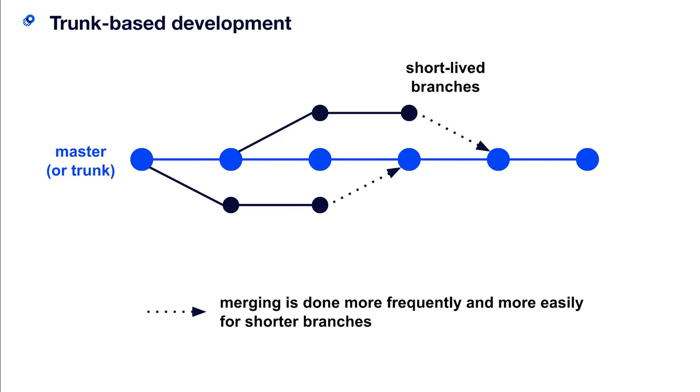

# Trunk-based development

Trunk-based development is a type of Git workflow that is based on a single, central repository where developers commit their code changes directly to the main branch, also known as the "trunk." This approach is in contrast to other Git workflows that rely on long-lived feature branches, where developers create a separate branch for each new feature they are working on.

<figure><figcaption></figcaption></figure>

Short-lived feature branches are a crucial element of trunk-based development. While developers are generally encouraged to commit code changes directly to the main branch, there may be times when they need to work on larger, more complex features that require more time to develop. In these cases, short-lived feature branches can isolate code changes for a specific feature.

To use short-lived feature branches, a developer creates a new branch from the main branch and changes their local copy of the repository. They can then commit these changes to the feature branch. When the feature is complete, the feature branch is merged back into the main branch.

One of the primary benefits of short-lived feature branches is that they allow developers to work on complex features without disrupting the main branch. This is particularly useful for organizations that use continuous integration (CI) systems to build and test code changes as they are committed. By isolating code changes in a feature branch, developers can avoid conflicts and ensure that the main branch remains stable and deployable at all times.

In addition to isolating code changes, short-lived feature branches also make it easier to review and test code changes before they are merged into the main branch. This can help to ensure that new features and fixes are of high quality and do not introduce new issues into the codebase. By encouraging developers to create short-lived feature branches for larger features, organizations can improve their ability to deliver new functionality and fixes to their customers in a timely and reliable manner.
