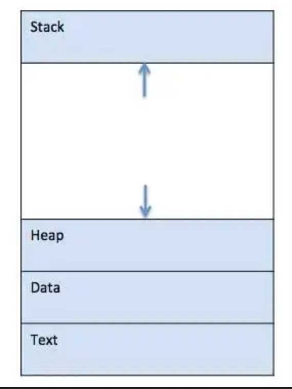

# Process Management

A process is an instance of a program that is being executed. The process follows a set sequence of steps when it is executing. In other words, when we write a program in a text file and run it, it becomes a process that performs the tasks specified in the program.

Process management is a crucial aspect of operating systems that deals with the creation, execution, and termination of processes.  Process management involves managing the resources required by processes, such as memory and CPU time, and ensuring that processes are executed efficiently and effectively. It also involves managing the communication and synchronization between processes and handling any conflicts that may arise. The process manager, a component of the operating system, is responsible for managing processes and ensuring that they run smoothly.&#x20;

When a program is loaded into memory and executed, it becomes a process that is divided into four sections: stack, heap, text, and data. The image below illustrates a simplified representation of the layout of a process in main memory.

<figure><figcaption></figcaption></figure>

* [Beej's Guide to Unix Interprocess Communication](https://beej.us/guide/bgipc/)
