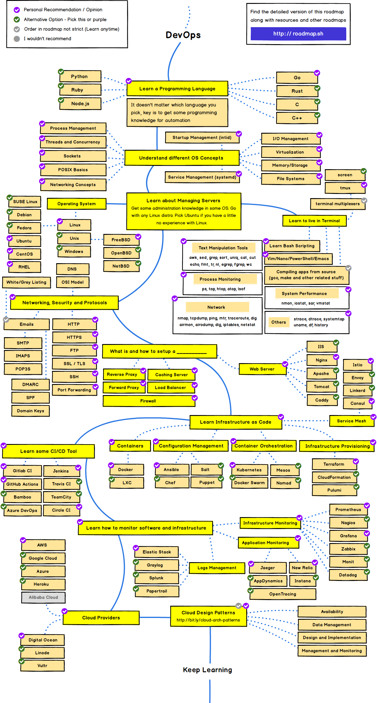

# Roadmap


See [roadmap.sh](https://roadmap.sh/devops) for a detailed roadmap


### Learn a Programming language 

You can pick a programming language of your choice.  All you need is some programming knowledge for automation. Since I am coming from a Python background, I'm listing some Python resources here.  



Some other options are - 

* Go
* Rust
* C
* C++
* Ruby
* Node.js

#### Understand different OS concepts

