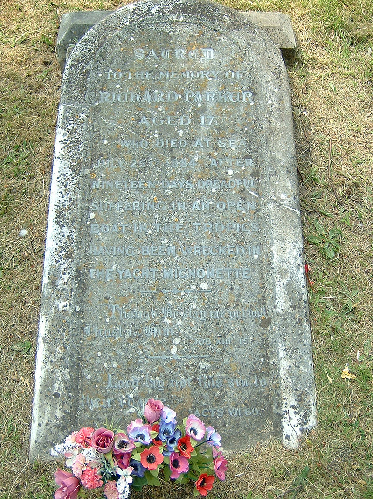

# Her Majesty The Queen v. Tom Dudley and Edwin Stephens


More on Wikipedia: [R v Dudley and Stephens](https://en.wikipedia.org/wiki/R\_v\_Dudley\_and\_Stephens)


This is a 19th-century British law case that is famous and much debated in law schools.&#x20;

