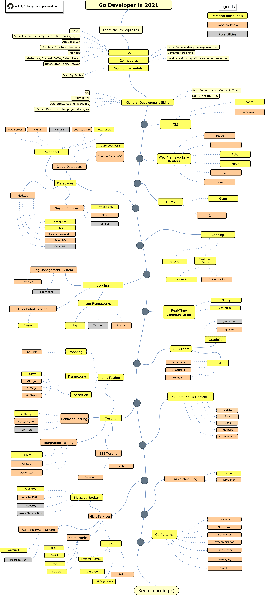

# Go

#### Installation

* ****[ **Download and install from the Go website**](https://golang.org/doc/install)****
* ****[**Download page**](https://golang.org/dl/)****

Visit the above links **** to **** to download the Go installer

Extract the archive you downloaded into `/usr/local`, creating a Go tree in `/usr/local/go`.

&#x20;For example, run the following as root or through `sudo`: (Change archive name as you need)

```
rm -rf /usr/local/go && tar -C /usr/local -xzf go1.16.6.linux-amd64.tar.gz
```

**Important: Above step will remove a previous installation at `/usr/local/go`, if any, prior to extracting. Please back up any data before proceeding.**

Add `/usr/local/go/bin` to the `PATH` environment variable.

&#x20;You can do this by adding the following line to your $HOME/.profile or /etc/profile (for a system-wide installation):

```
export PATH=$PATH:/usr/local/go/bin
```

Verify that you've installed Go by opening a command prompt and typing the following command:

```
$ go version
```

#### Learning Roadmap



####

#### Resources

* &#x20;**** [**GoBooks**](https://github.com/dariubs/GoBooks)****
