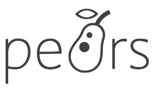

# PeARS

### [Official Website](https://pearsproject.org/)

### 

### Scientific publications related to PeARS project

A short system description was published at WWW2016



A scientific evaluation of the accuracy of the system, published at the SEM2016 conference



