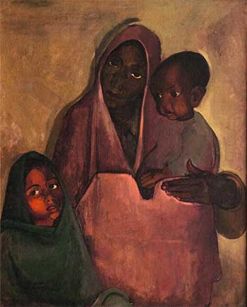

# Paintings

ദേശരാഷ്ട്രങ്ങളുടെ രൂപീകരണ സന്ദര്‍ഭങ്ങളില്‍ തന്നെ അവയുടെ മാനുഷികവത്കരിക്കപ്പെട്ട കലാപ്രതിനിധാനങ്ങള്‍ എല്ലാ സമൂഹങ്ങളിലും രൂപപ്പെടുന്നുണ്ട്. യൂജിന്‍ ദെലേക്രോയിക്‌സിന്റെ വിഖ്യാതമായ ചിത്രം Liberty Leading the People നോക്കുക. ഫ്രഞ്ച് വിപ്ലവകാലത്ത് വരയ്ക്കപ്പെട്ട ഈ ചിത്രം വലതു കൈയില്‍ ഫ്രഞ്ച് പതാകയും ഇടതു കൈയില്‍ റൈഫിളുമേന്തി അര്‍ധനഗ്‌നയായ ഒരു യുവതി ബാരിക്കേഡുകള്‍ ചാടിക്കടന്നു ആയുധധാരികളായ ജനങ്ങളെ നയിച്ചു കൊണ്ട് മുന്നേറുന്നതിന്റെ ചിത്രണമാണ്. റിയലിസ്റ്റ് സങ്കേതത്തില്‍ വരയ്ക്കപ്പെട്ട ഒന്ന്. ഫ്രാന്‍സിനെ സുന്ദരിയും തെരുവില്‍ നിന്നെഴുന്നേറ്റു വരുന്നവളുമായ ഒരു യുവതിയോട് ഉപമിച്ച ഈ ചിത്രത്തിന്റെ മറുഭാഗത്താണ് ഭാരതമാതാവിനെക്കുറിച്ചുള്ള ചിത്രമെഴുത്തുകളുള്ളത്. കല്‍ക്കട്ടയില്‍ നിന്ന് അടിച്ചിറക്കപ്പെട്ട നൂറ് കണക്കിന് ലിത്തോഗ്രാഫ് പ്രിന്റുകളില്‍ ഹിന്ദു ദേവതയായ ദുര്‍ഗ്ഗയുടെ ഭാവാഹാവാദികളായിരുന്നു ഭാരതമാതാവിന്. അബനീന്ദ്രനാഥാടാഗോറിന്റെ ഭാരത് മാതാ ഈ ദുര്‍ഗ്ഗാ സങ്കല്പനത്തിന്റെ പൂര്‍ണതയിലാണുദയം കൊണ്ടത്.

ഇരുപതാം നൂറ്റാണ്ട് തുടക്കഘട്ടത്തിലെ ദുര്‍ഗ്ഗാ-ഭാരതമാതാവ് തര്‍ജ്ജമകള്‍ നിര്‍മ്മിച്ച രാഷ്ട്രീയത്തിനെതിരെ വന്ന ഏറ്റവും പ്രധാന ചിത്രം അമൃതാ ഷെര്‍ഗിലിന്റെ Mother India ആണ്. ഒരു രാഷ്ട്രീയ പ്രസ്താവന എന്ന നിലയില്‍ വായിച്ചെടുക്കാവുന്ന ആ ചിത്രം നിരാംലംബയും ദുഖിതയും രണ്ടു പെണ്‍കുട്ടികളുടെ അമ്മയുമായ ഒരു ഗ്രാമീണ യുവതിയെയാണ് ഭാരതമാതാവായി അവതരിപ്പിക്കുന്നത്.    - [Source](https://truecopythink.media/Rafeek-ibrahim-article-about-basheers-writings)&#x20;

* Liberty Leading the People

* Mother India&#x20;

