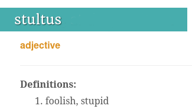
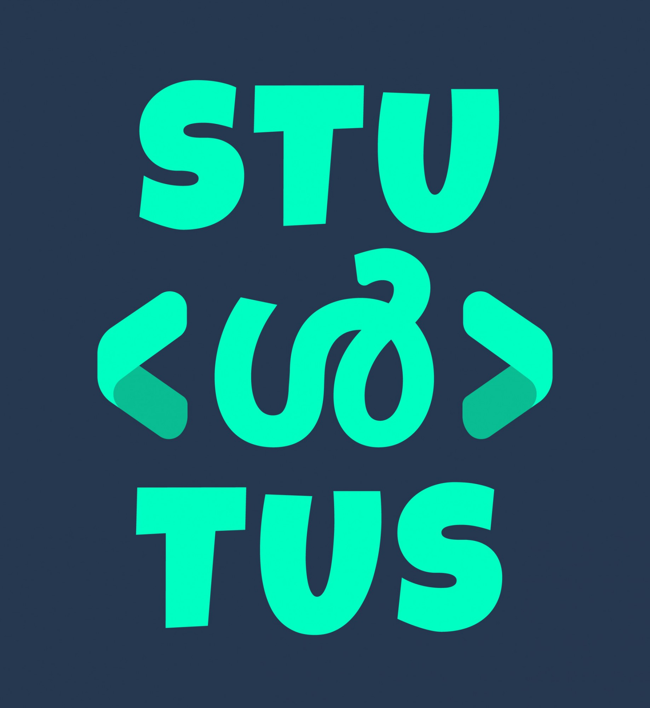

# Stultus

'Stultus' is a Latin word and it means 'Stupid/Foolish'.

_`stultus`_ is the [pseudonym](https://en.wikipedia.org/wiki/Pseudonym) I regularly use on different platforms.  If this is not available on a particular platform, I use slightly altered versions like _`stultusz` ,_ _`stultuzz`_ or _`_stultus.`_ 

I started to use this pseudonym in [IRC](https://en.wikipedia.org/wiki/Internet_Relay_Chat) chat-rooms in 2008. Those were the days, my friends. Those were the days. Pseudonyms were a thing in IRC. Also I think it is cool to have one.  Thus the name and  thus the domain name. 

I recommend reading this article on wired.com -  [We Need Online Alter Egos Now More Than Ever](https://www.wired.com/2014/04/why-we-need-online-alter-egos-now-more-than-ever/). Technically a pseudonym is not necessarily an alter ego, but you get the idea.  

My friend [Arun Sajeev](https://inspiredmonster.com) created the following DP for me.  It uses the word 'Stultus'  with malayalam letter '[ൾ](https://www.fileformat.info/info/unicode/char/0d7e/index.htm)' instead of 'L'.  

 

