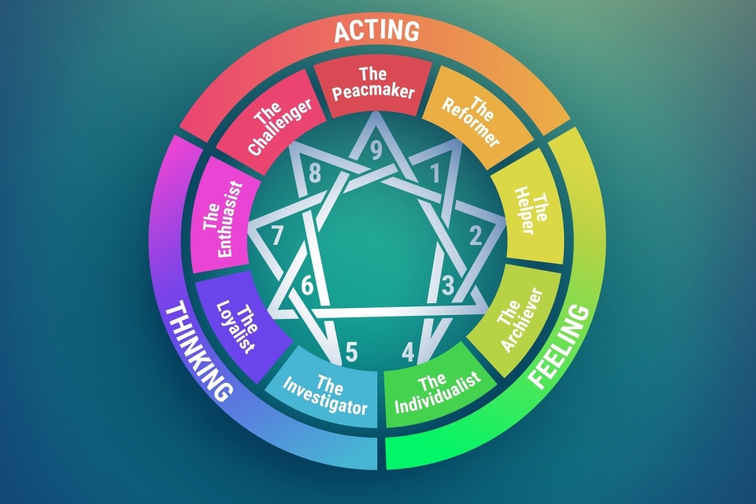

# Enneagram

The Enneagram is a personality typing system that divides people into nine different types, each with its own distinct traits and characteristics. It is based on the belief that individuals have a fundamental way of perceiving and responding to the world, and that this perspective shapes their behaviours and actions. The nine Enneagram types are described as a series of points on a circle, with each point representing a different set of core motivations, fears, and desires. The Enneagram can be a helpful tool for self-discovery and personal growth. It provides insight into how an individual's thinking and behaviour patterns may be influenced by their underlying motivations and fears. It can also be useful for building stronger relationships, as it can help individuals better understand and communicate with others who may have different personality types.

<figure><figcaption></figcaption></figure>

In screenwriting, the Enneagram can be a useful tool for creating well-rounded and believable characters. By determining a character's Enneagram type, a screenwriter can gain insight into the character's motivations, fears, and desires, and use this information to shape their actions and decisions in the story. For example, a character who is an Enneagram Type 2, known as the Helper, might be motivated by a desire to be needed and appreciated and may make decisions based on this desire to be helpful and supportive to others. By understanding the Enneagram type of a character, a screenwriter can more fully flesh out the character's personality and create a more believable and relatable character for audiences. In addition to character development, the Enneagram can also be useful for understanding and improving relationships between characters in a story, as it provides insight into how different personality types may interact and communicate.
