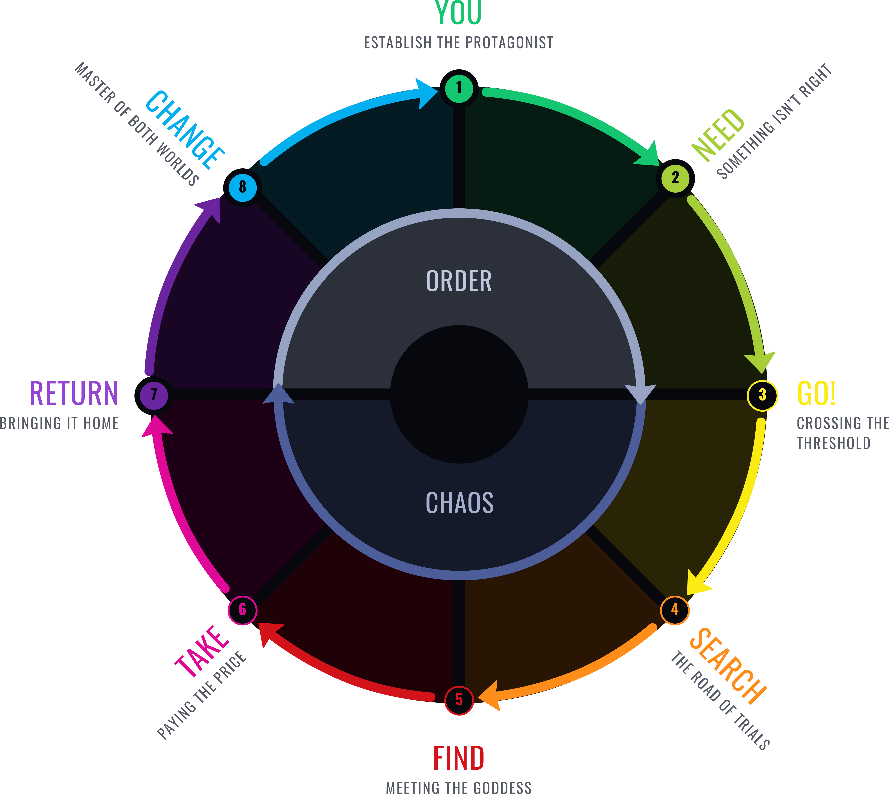
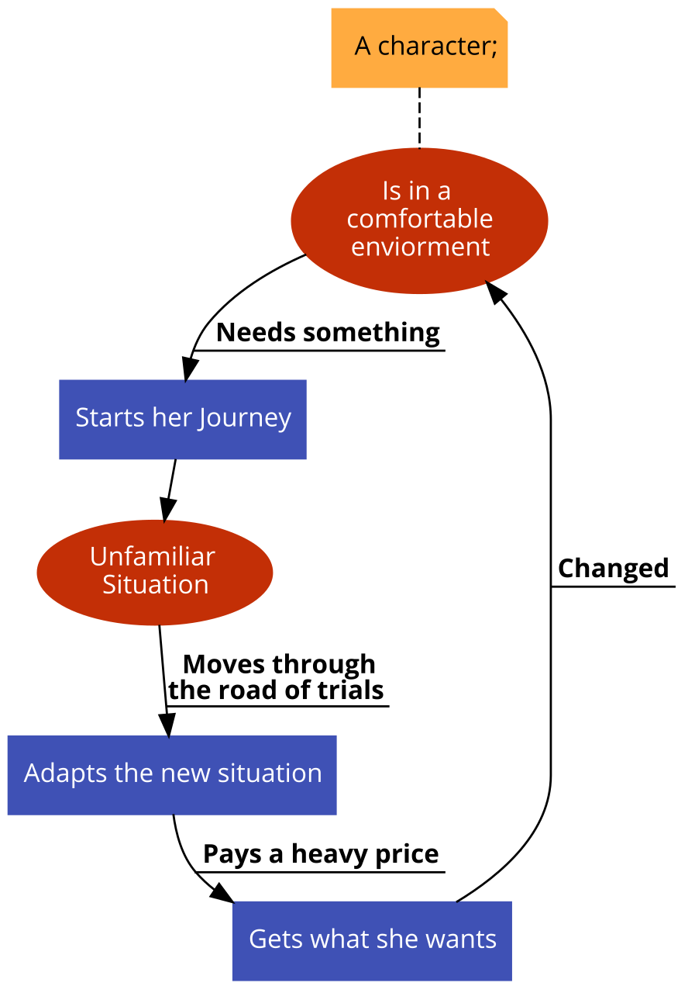

# Story Structure

### Dan Harmon's Story Cycle

Here is a flow chart I created :

* ****[**Story Structure 101: Super Basic Shit**](https://channel101.fandom.com/wiki/Story\_Structure\_101:\_Super\_Basic\_Shit)****
* ****[**Story Structure 102: Pure, Boring Theory**](https://channel101.fandom.com/wiki/Story\_Structure\_102:\_Pure,\_Boring\_Theory)****
* ****[**Story Structure 103: Let's Simplify Before Moving On**](https://channel101.fandom.com/wiki/Story\_Structure\_103:\_Let's\_Simplify\_Before\_Moving\_On)****
* ****[ **Story Structure 104: The Juicy Details**](https://channel101.fandom.com/wiki/Story\_Structure\_104:\_The\_Juicy\_Details)****





