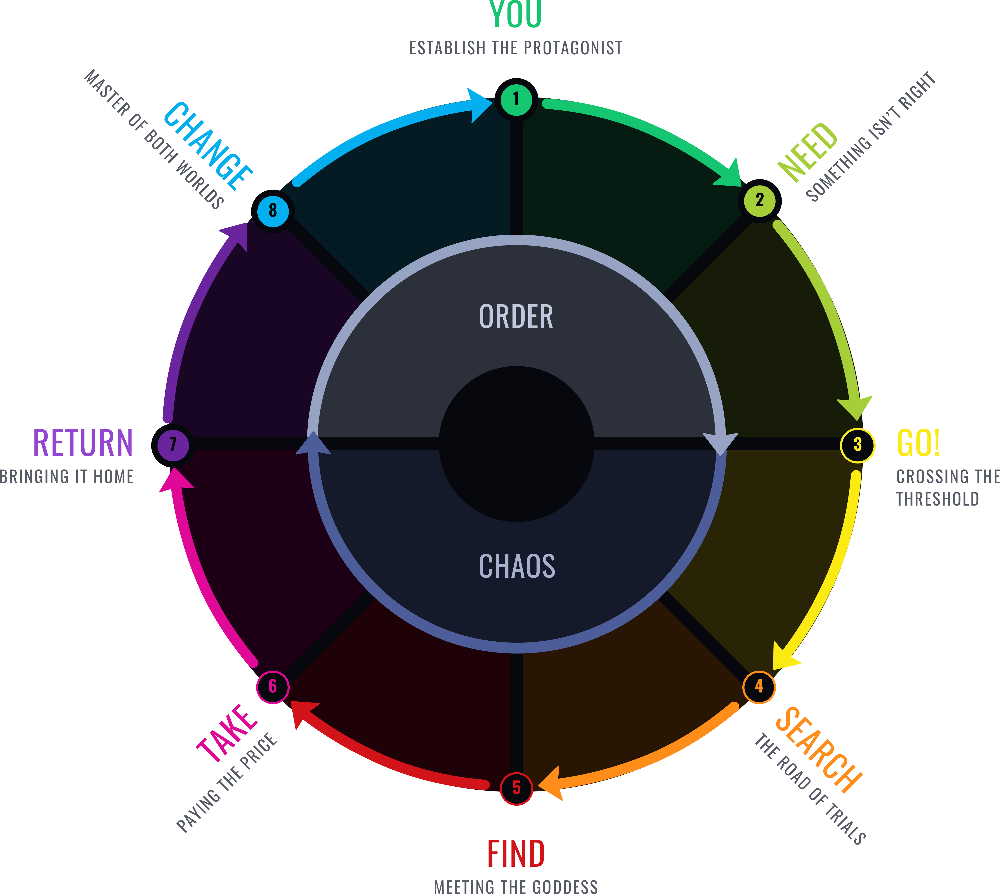
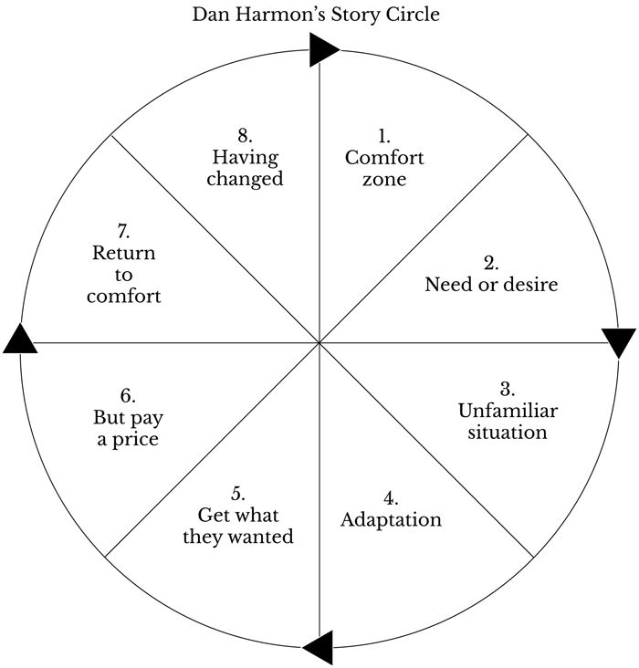

# Story Structure

### Dan Harmon's Story Cycle

* \*\*\*\*[**Story Structure 101: Super Basic Shit**](https://channel101.fandom.com/wiki/Story_Structure_101:_Super_Basic_Shit)\*\*\*\*
* \*\*\*\*[**Story Structure 102: Pure, Boring Theory**](https://channel101.fandom.com/wiki/Story_Structure_102:_Pure,_Boring_Theory)\*\*\*\*
* \*\*\*\*[**Story Structure 103: Let's Simplify Before Moving On**](https://channel101.fandom.com/wiki/Story_Structure_103:_Let%27s_Simplify_Before_Moving_On)\*\*\*\*
* \*\*\*\*[ **Story Structure 104: The Juicy Details**](https://channel101.fandom.com/wiki/Story_Structure_104:_The_Juicy_Details)\*\*\*\*





