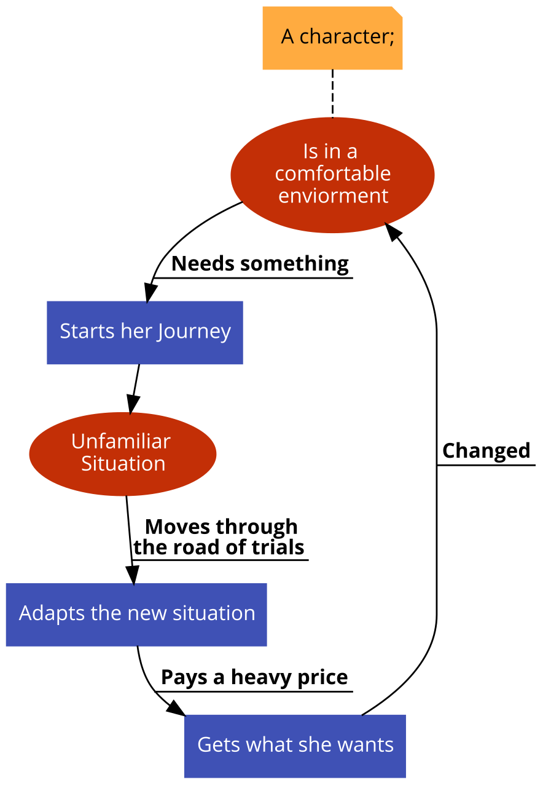

# Dan Harmon's Story Cycle

Dan Harmon's Story Cycle is a narrative structure developed by writer and producer Dan Harmon that breaks down a story into eight distinct stages. Harmon developed this structure as a way to help writers understand and analyze the different components of a story, and to create a more cohesive and satisfying narrative.

The eight stages of the Story Cycle are as follows:

1. Thesis: This stage represents the beginning of the story, where the main character is introduced and their world is established.
2. Antithesis: In this stage, something disrupts the main character's world and challenges their beliefs or values.
3. Synthesis: This stage represents the main character's response to the disruption and their efforts to resolve the conflict or problem introduced in the Antithesis stage.
4. Break into Two: This stage marks the turning point of the story, where the main character makes a significant decision or takes action that sets the story on a new course.
5. B Story: This stage represents the main character's personal journey or character arc, and may include subplots or supporting characters.
6. Fun and Games: This stage is where the main conflict or problem of the story is explored and tested, often through action or humorous moments.
7. Midpoint: This stage marks the halfway point of the story and represents a significant event or realization for the main character.
8. Bad Guys Close In: This stage represents the climax of the story, where the main character is faced with their greatest challenge and must overcome it in order to achieve their goal.

Here is a flow chart I created :

* ****

